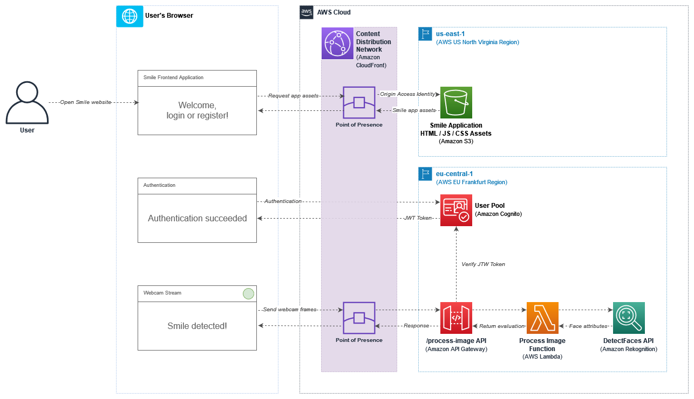
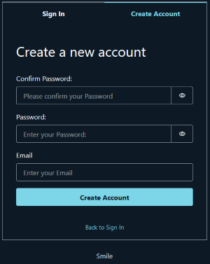
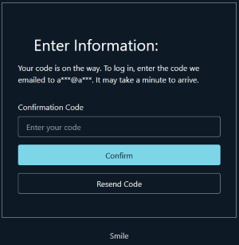
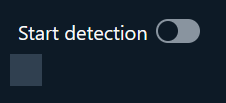

# Smile

Abstract: A fully functional web application that streams video from a webcam and detects smiles using Amazon Rekognition.

In this proof-of-concept (PoC) project, I will demonstrate how to build a fully serverless web application on AWS that analyzes a webcam video stream and detects smiles in near real-time using Amazon Rekognition. The goal of this PoC is to showcase the integration of computer vision technologies in modern web applications and to provide a fun and engaging user experience.

## Deployment

To deploy/destroy the stack, follow the instructions at [docs/DEPLOYMENT.md](./docs/DEPLOYMENT.md).

## Architecture

All services adopted in this PoC have been selected for three main reasons: 1/ AWS managed serverless services to reduce operational overhead, offload security heavy-lifting to AWS, and establish a granular consumption-based cost model; 2/ boost development speed and benefit from a well-tuned computer vision service at low cost; 3/ all services can be deployed using AWS CDK as IaC tool.

Services breakdown:

- [Amazon CloudFront](https://aws.amazon.com/cloudfront/): a content distribution network (CDN) used to deliver content at low-latency across the globe;
- [S3](https://aws.amazon.com/s3/): a highly available and durable object storage service. In this project I will use it to store web application static assets, such as JS, CSS, HTML files;
- [Amazon Cognito](https://aws.amazon.com/cognito/): a secure and scalable user identity and access management service. In this project I’ll use it to implement user registration and login capabilities;
- [Amazon API Gateway](https://aws.amazon.com/api-gateway/): a scalable HTTP/REST API Gateway which offers out-of-the-box integrations with Amazon Cognito for authentication, Amazon Lambda and other compute services for downstream request routing;
- [AWS Lambda](https://aws.amazon.com/lambda/): a function-as-a-service solution. In this project I will use it as a wrapper for the interaction and evaluation of the Amazon Rekognition API response;
- [AWS Rekognition](https://aws.amazon.com/rekognition/): a deep learning-based image and video recognition service with face detection and analysis capabilities.

## Usage

1. You will land on the Sign-In page by default.
2. If this is the first time running the app, click on the Create Account tab (top right)
3. Set & confirm your password, set your email, and click on Create Account

> **Important:**
> This application allows anyone with the URL to create an account and sign-up. The use on production is not recommended.

4. Enter the confirmation code you will receive by email

5. Start the Smile detection!

## License

This library is licensed under the MIT-0 License. See the [LICENSE](./LICENSE) file.