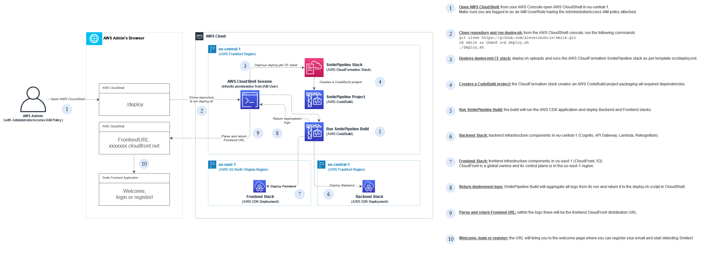

# Smile Deployment Overview

Abstract: In this page, we will zoom into the deployment steps, providing step-by-step deployment guidance and a high-level overview of the IaC toolset adopted to deploy [Smile](../README.md).

## ✅ Before you deploy

Check your AWS IAM User or IAM Role permissions.
> **Warning:**
> Make sure you are logged in as an IAM User or IAM Role having the [AdministratorAccess](https://docs.aws.amazon.com/aws-managed-policy/latest/reference/AdministratorAccess.html) IAM managed policy attached.

The deployment requires AdministratorAccess to create CodeBuild pipelines, deploy CDK stacks, and respective IAM Roles.

## 🚀 Deployment
1. Open [AWS CloudShell in eu-central-1](https://eu-central-1.console.aws.amazon.com/cloudshell/home?region=eu-central-1#)
2. Run the deployment via the following commands

```sh
git clone https://github.com/alessionobile/smile.git
cd smile
chmod u+x deploy.sh
./deploy.sh
```

3. After about 15 minutes you will get the following output:

```
202X-XX-XX XX:XX:XX [Smile] ✅ Go Smile at https://xxxxxxxxx.cloudfront.net
```

4. Open the provided link from your browser.

## Deployment Pipeline Architecture

This deployment architecture has been built with three objectives in mind:

**1. Deploy/destroy in one simple step:** stacks can be deployed/destroyed by running [deploy.sh](../deploy.sh) and [destroy.sh](../destroy.sh) from AWS CloudShell.

**2. Eliminate local libraries dependencies:** the workflow runs entirely on AWS services and does not require a local environment.
- [AWS CloudShell](https://aws.amazon.com/cloudshell/) is used to initiate a terminal session in your AWS Console and initiate deploy/destroy;
- [AWS CloudFormation](https://aws.amazon.com/cloudformation/) is used to create an AWS CodeBuild project, as described in [src/deploy.yml](../src/deploy.yml);
- [AWS CodeBuild](https://aws.amazon.com/codebuild/) runs [AWS CDK for Typescript](https://docs.aws.amazon.com/cdk/v2/guide/home.html) to deploy Frontend and Backend stacks, as described in [src/infrastructure/app.ts](../src/infrastructure/app.ts).

**3. Set the stage for CI/CD:** the proposed architecture sets the foundation for the implementation of Continuous Integration and Continuous Deployment (CI/CD).



## Clean up

If your CloudShell session is still open from previous steps:

```sh
chmod u+x destroy.sh
./destroy.sh
```

Otherwise:

1. Open [CloudShell in eu-central-1](https://eu-central-1.console.aws.amazon.com/cloudshell/home?region=eu-central-1#)
2. Clone the repo and destroy the Smile environment with the following commands:

```sh
git clone https://github.com/alessionobile/smile.git
cd smile
chmod u+x destroy.sh
./destroy.sh
```

Expected output:

```
202X-XX-XX XX:XX:XX [Smile] [FrontendStack] ✅ Deleted.
202X-XX-XX XX:XX:XX [Smile] [BackendStack] ✅ Deleted.
202X-XX-XX XX:XX:XX [Smile] [SmilePipeline Stack] ✅ Deleted.
```

The process will delete three stacks and marks the clean up process as completed.